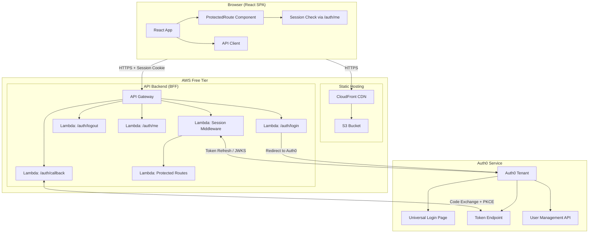
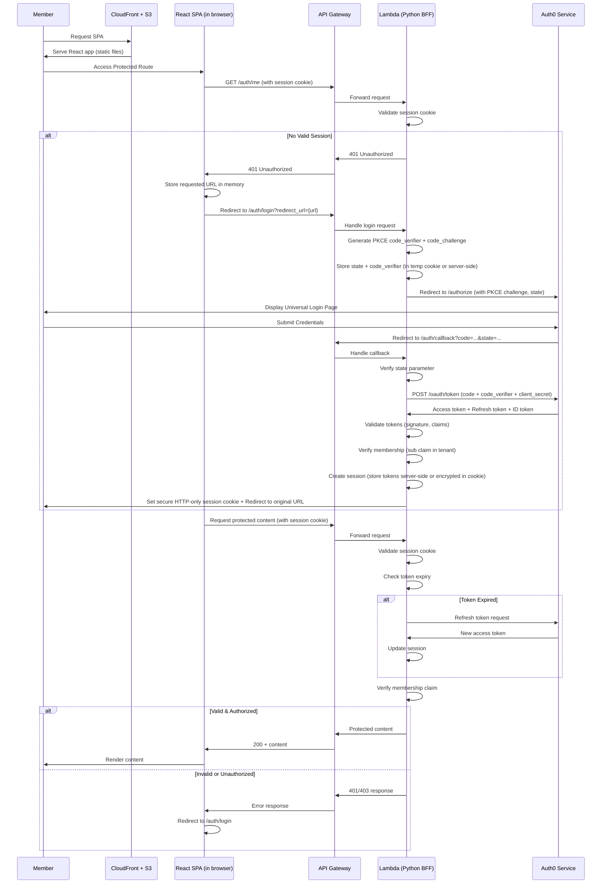
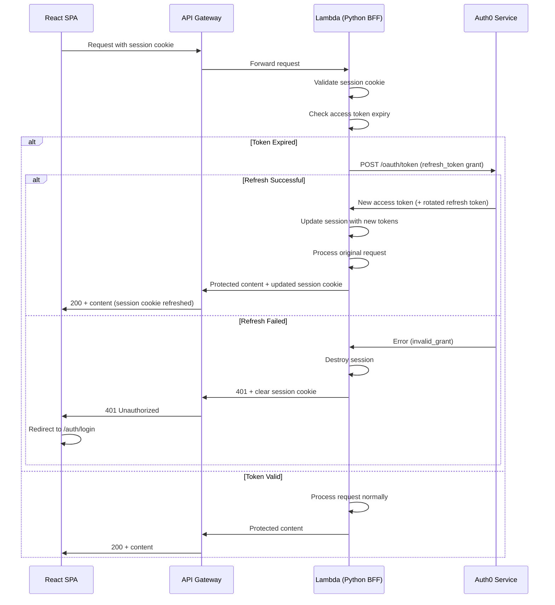
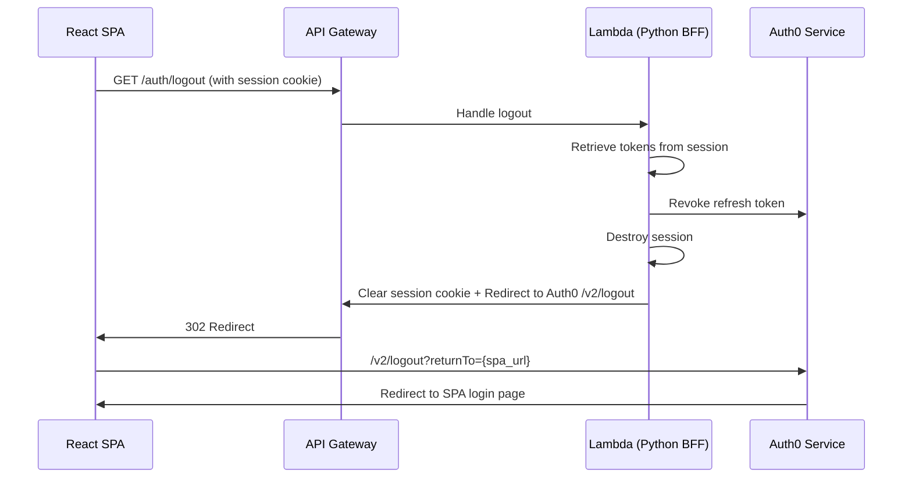
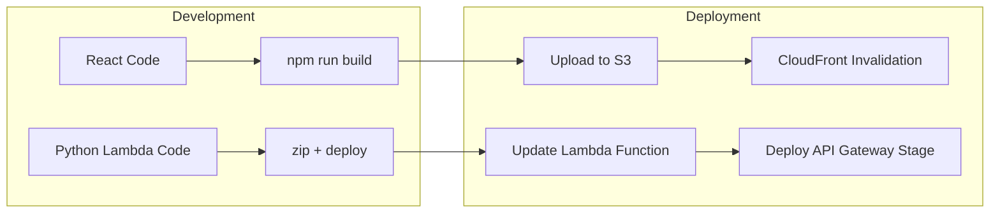

# Design Document

## Overview

The music-group-app is a private single-page application (SPA) serving a 20-member music group. It uses React as the frontend framework and a Python-based AWS Lambda backend that acts as a **Backend for Frontend (BFF)** — all Auth0 communication is handled exclusively by the backend. The React SPA never communicates directly with Auth0 and never handles raw tokens. The React SPA is hosted as static files on S3 with CloudFront as the CDN. The entire stack runs within the AWS free tier for **$0 operational cost**.

**Key Design Decisions:**

- **BFF Pattern (Backend for Frontend)**: The Python Lambda acts as a confidential OAuth2 client. All Auth0 interactions (login, callback, logout, token refresh) happen server-side. The frontend only deals with a session cookie.
- **React SPA (no Auth0 SDK)**: The frontend has no Auth0Provider, no useAuth0 hook, and no token management. It checks for a valid session cookie and redirects to the backend's `/auth/login` endpoint if unauthenticated.
- **Secure HTTP-only session cookies**: After successful authentication, the backend sets a secure, HTTP-only, SameSite=Lax cookie. Tokens are stored server-side (or encrypted in the cookie). The browser never sees raw access/refresh tokens.
- **Authorization Code Flow with PKCE (server-side)**: The Lambda backend initiates PKCE with Auth0, receives the callback, exchanges the code for tokens, and establishes the session — all without exposing tokens to the browser.
- **Python AWS Lambda backend**: Handles all auth flows, validates sessions, verifies membership, and serves protected content. Python chosen for its simplicity and excellent OAuth/JWT library ecosystem.
- **AWS API Gateway**: Exposes Lambda functions as REST endpoints with HTTPS enforcement, request throttling, and CORS support.
- **S3 + CloudFront for SPA hosting**: Static React build served globally via CloudFront CDN with HTTPS. No server to manage.
- **Auth0 free tier**: Supports up to 7,000 monthly active users (well within 20 members), provides refresh token rotation, and handles credential storage.
- **Confidential client**: The Lambda backend stores the Auth0 client secret securely, enabling server-to-server token exchange.

**Cost Analysis (AWS Free Tier):**

| Service | Free Tier Allowance | Expected Usage (20 members) |
|---------|--------------------|-----------------------------|
| Lambda | 1M requests/month, 400,000 GB-seconds | ~1,000 requests/month |
| API Gateway | 1M API calls/month (first 12 months) | ~1,000 calls/month |
| S3 | 5 GB storage, 20,000 GET requests | < 100 MB storage, ~5,000 GETs |
| CloudFront | 1 TB transfer/month (first 12 months) | < 1 GB/month |
| Auth0 | 7,000 MAU | 20 MAU |

## Architecture



### Authentication Flow (BFF Pattern)



### Token Refresh Flow (Server-Side)



### Logout Flow



### Deployment Architecture



## Components and Interfaces

### Frontend Components

| Component | Responsibility |
|-----------|---------------|
| `App` | Root component, wraps application with session context provider |
| `SessionProvider` | Context provider that checks `/auth/me` on mount and exposes session state |
| `ProtectedRoute` | Route wrapper that redirects to `/auth/login` if session is invalid |
| `LoginPage` | Public page with a button/link that navigates to `/auth/login` backend endpoint |
| `UnauthorizedPage` | Shown when `/auth/me` returns 403 (authenticated but not a member) |
| `LogoutButton` | Navigates to `/auth/logout` backend endpoint |
| `ApiClient` | Fetch wrapper that sends requests with `credentials: 'include'` (sends session cookie) |
| `ErrorBoundary` | Catches errors, displays retry options for service unavailability |

### Backend Components (Python Lambda — BFF)

| Component | Responsibility |
|-----------|---------------|
| `handler.py` | Main Lambda entry point, routes requests based on API Gateway event path |
| `auth_login.py` | Handles `/auth/login` — generates PKCE params, stores state, redirects to Auth0 |
| `auth_callback.py` | Handles `/auth/callback` — exchanges code for tokens, creates session, sets cookie |
| `auth_logout.py` | Handles `/auth/logout` — revokes tokens, destroys session, clears cookie |
| `auth_me.py` | Handles `/auth/me` — validates session cookie, returns user info or 401 |
| `session.py` | Session management: create, validate, refresh, destroy. Handles cookie encryption/decryption |
| `oauth_client.py` | Auth0 OAuth2 client: PKCE generation, token exchange, token refresh, token revocation |
| `membership.py` | Verifies user is a registered member via token claims or Auth0 Management API |
| `routes.py` | Route handlers serving protected group content |
| `errors.py` | Centralized error handling, ensures no content leaks on auth failures |
| `config.py` | Configuration from environment variables (Auth0 domain, client ID, client secret, etc.) |

### Interfaces

```python
# Lambda Configuration (Backend — Confidential Client)
@dataclass
class LambdaConfig:
    auth0_domain: str              # Auth0 tenant domain
    auth0_client_id: str           # Application client ID
    auth0_client_secret: str       # Application client secret (confidential)
    auth0_audience: str            # API identifier
    auth0_algorithms: list         # ['RS256']
    session_secret: str            # Secret key for encrypting session cookies
    spa_base_url: str              # CloudFront URL (for redirects back to SPA)
    api_base_url: str              # API Gateway URL (for callback URL)
    inactivity_timeout_s: int      # 1800 (30 minutes)
    absolute_timeout_s: int        # 259200 (72 hours)
    cookie_name: str               # Session cookie name
    cookie_max_age_s: int          # 259200 (72 hours, matches absolute timeout)
```

```python
# Session Data (stored encrypted in cookie or server-side)
@dataclass
class SessionData:
    user_id: str                   # Auth0 sub claim
    email: str                     # User email
    name: str                      # Display name
    access_token: str              # Current access token (never sent to browser)
    refresh_token: str             # Refresh token (never sent to browser)
    token_expires_at: int          # Unix timestamp when access token expires
    session_created_at: int        # Unix timestamp of session creation
    last_activity_at: int          # Unix timestamp of last request

# Session Validation Result
@dataclass
class SessionValidationResult:
    is_valid: bool
    session: SessionData | None    # Decoded session if valid
    error: str | None              # Error description if invalid
    reason: str | None             # 'expired', 'inactive', 'invalid', 'missing'
```

```python
# OAuth2 PKCE State (stored temporarily during auth flow)
@dataclass
class AuthState:
    state: str                     # Random state parameter (CSRF protection)
    code_verifier: str             # PKCE code verifier
    redirect_url: str              # Original URL user was trying to access
    created_at: int                # Unix timestamp (for expiry)

# Token Exchange Request
@dataclass
class TokenExchangeRequest:
    code: str                      # Authorization code from Auth0
    code_verifier: str             # PKCE code verifier
    redirect_uri: str              # Must match the one used in /authorize

# Token Exchange Response (from Auth0)
@dataclass
class TokenResponse:
    access_token: str
    refresh_token: str
    id_token: str
    token_type: str                # 'Bearer'
    expires_in: int                # Seconds until access token expires
```

```python
# Membership Verification Result
@dataclass
class MembershipResult:
    is_member: bool
    user_id: str
    email: str

# API Gateway Lambda Event (simplified)
@dataclass
class APIGatewayEvent:
    http_method: str
    path: str
    headers: dict
    query_string_parameters: dict | None
    body: str | None

# Lambda Response
@dataclass
class LambdaResponse:
    status_code: int
    headers: dict                  # Includes Set-Cookie for session management
    body: str                      # JSON-encoded response body
```

```typescript
// Frontend Session State (no tokens — only user info from /auth/me)
interface SessionState {
  isAuthenticated: boolean;
  isLoading: boolean;
  user: UserInfo | null;
  error: string | null;
}

interface UserInfo {
  userId: string;
  email: string;
  name: string;
  picture?: string;
}
```

### Auth Endpoint Handlers (Python Lambda BFF)

```python
# /auth/login — Initiates OAuth2 Authorization Code Flow with PKCE
def handle_auth_login(event: APIGatewayEvent) -> LambdaResponse:
    redirect_url = event.query_string_parameters.get("redirect_url", "/")

    # Generate PKCE parameters
    code_verifier = generate_code_verifier()
    code_challenge = generate_code_challenge(code_verifier)
    state = generate_random_state()

    # Store state + code_verifier in a short-lived encrypted cookie
    auth_state = AuthState(state=state, code_verifier=code_verifier,
                           redirect_url=redirect_url, created_at=now())

    # Build Auth0 /authorize URL
    authorize_url = build_authorize_url(
        domain=config.auth0_domain,
        client_id=config.auth0_client_id,
        redirect_uri=f"{config.api_base_url}/auth/callback",
        audience=config.auth0_audience,
        scope="openid profile email offline_access",
        state=state,
        code_challenge=code_challenge,
        code_challenge_method="S256",
    )

    return redirect_response(authorize_url, set_auth_state_cookie(auth_state))


# /auth/callback — Handles Auth0 redirect after login
def handle_auth_callback(event: APIGatewayEvent) -> LambdaResponse:
    code = event.query_string_parameters["code"]
    state = event.query_string_parameters["state"]

    # Retrieve and validate auth state from cookie
    auth_state = get_auth_state_from_cookie(event)
    if auth_state.state != state:
        return error_response(403, "Invalid state parameter")

    # Exchange code for tokens (server-to-server, includes client_secret)
    token_response = exchange_code_for_tokens(
        code=code,
        code_verifier=auth_state.code_verifier,
        redirect_uri=f"{config.api_base_url}/auth/callback",
    )

    # Validate tokens
    claims = validate_id_token(token_response.id_token)

    # Verify membership
    membership = check_membership(claims["sub"])
    if not membership.is_member:
        return redirect_response(f"{config.spa_base_url}/unauthorized")

    # Create session
    session = SessionData(
        user_id=claims["sub"],
        email=claims["email"],
        name=claims["name"],
        access_token=token_response.access_token,
        refresh_token=token_response.refresh_token,
        token_expires_at=now() + token_response.expires_in,
        session_created_at=now(),
        last_activity_at=now(),
    )

    # Set session cookie and redirect to original URL
    return redirect_response(
        f"{config.spa_base_url}{auth_state.redirect_url}",
        set_session_cookie(session),
        clear_auth_state_cookie(),
    )


# /auth/me — Returns current user info or 401
def handle_auth_me(event: APIGatewayEvent) -> LambdaResponse:
    session_result = validate_session(event)
    if not session_result.is_valid:
        return unauthorized_response(clear_session_cookie())

    return json_response(200, {
        "userId": session_result.session.user_id,
        "email": session_result.session.email,
        "name": session_result.session.name,
    })


# /auth/logout — Terminates session and revokes tokens
def handle_auth_logout(event: APIGatewayEvent) -> LambdaResponse:
    session_result = validate_session(event)
    if session_result.is_valid:
        revoke_refresh_token(session_result.session.refresh_token)

    logout_url = build_logout_url(
        domain=config.auth0_domain,
        return_to=f"{config.spa_base_url}/login",
        client_id=config.auth0_client_id,
    )

    return redirect_response(logout_url, clear_session_cookie())
```

### Session Middleware Pipeline (Python Lambda)

```python
# Request processing order for protected routes
def handle_protected_request(event: APIGatewayEvent) -> LambdaResponse:
    # 1. Validate session cookie
    session_result = validate_session(event)
    if not session_result.is_valid:
        return unauthorized_response(clear_session_cookie())

    session = session_result.session

    # 2. Check session timeouts
    if is_inactive_timeout(session, config.inactivity_timeout_s):
        return session_expired_response(clear_session_cookie())
    if is_absolute_timeout(session, config.absolute_timeout_s):
        return session_expired_response(clear_session_cookie())

    # 3. Refresh access token if expired (transparent to frontend)
    updated_cookie = None
    if is_token_expired(session):
        try:
            new_tokens = refresh_access_token(session.refresh_token)
            session.access_token = new_tokens.access_token
            session.refresh_token = new_tokens.refresh_token
            session.token_expires_at = now() + new_tokens.expires_in
            updated_cookie = set_session_cookie(session)
        except TokenRefreshError:
            return unauthorized_response(clear_session_cookie())

    # 4. Verify membership (on each request)
    membership = check_membership(session.user_id)
    if not membership.is_member:
        return forbidden_response(clear_session_cookie())

    # 5. Update last activity timestamp
    session.last_activity_at = now()

    # 6. Route to appropriate handler
    response = route_request(event, session)

    # 7. Attach updated session cookie if tokens were refreshed
    if updated_cookie:
        response.headers.update(updated_cookie)

    return response
```

## Data Models

### Auth0 Tenant Configuration

The Auth0 tenant is the single source of truth for membership. No separate user database is required. The application is registered as a **Regular Web Application** (confidential client) in Auth0, not as a SPA.

```python
# Auth0 Application Configuration (Regular Web Application — confidential client)
AUTH0_APP_CONFIG = {
    "type": "Regular Web Application",  # NOT SPA — enables client_secret
    "grant_types": ["authorization_code", "refresh_token"],
    "token_endpoint_auth_method": "client_secret_post",
    "callbacks": ["https://{api-gateway-url}/auth/callback"],
    "allowed_logout_urls": ["https://{cloudfront-url}/login"],
    "allowed_web_origins": ["https://{cloudfront-url}"],
}
```

```python
# Auth0 User (stored in Auth0 tenant)
@dataclass
class Auth0User:
    user_id: str             # Auth0 unique identifier
    email: str               # Member email
    name: str                # Display name
    picture: str | None      # Avatar URL
    email_verified: bool     # Email verification status
    created_at: str          # ISO 8601 timestamp
    last_login: str | None   # ISO 8601 timestamp

# JWT Access Token Claims (decoded server-side by Lambda only)
@dataclass
class AccessTokenClaims:
    iss: str                 # Issuer: https://{domain}/
    sub: str                 # Subject: Auth0 user_id
    aud: str | list          # Audience: API identifier
    iat: int                 # Issued at (Unix timestamp)
    exp: int                 # Expiration (Unix timestamp)
    scope: str               # Granted scopes
    azp: str                 # Authorized party (client ID)
```

### Session Cookie Structure

```python
# Session cookie is a single encrypted blob containing session data.
# The cookie is:
#   - HTTP-only (not accessible via JavaScript)
#   - Secure (only sent over HTTPS)
#   - SameSite=Lax (CSRF protection while allowing top-level navigations)
#   - Domain scoped to API Gateway domain
#   - Max-Age: 72 hours (absolute session timeout)

SESSION_COOKIE_CONFIG = {
    "name": "music_group_session",
    "httponly": True,
    "secure": True,
    "samesite": "Lax",
    "path": "/",
    "max_age": 259200,       # 72 hours in seconds
}

# Auth state cookie (short-lived, used during OAuth flow only)
AUTH_STATE_COOKIE_CONFIG = {
    "name": "music_group_auth_state",
    "httponly": True,
    "secure": True,
    "samesite": "Lax",
    "path": "/auth",
    "max_age": 300,          # 5 minutes (auth flow should complete quickly)
}
```

### API Gateway Route Structure

```python
# Route definitions for API Gateway + Lambda
# Auth routes are public (handle their own auth logic)
# All other routes require a valid session cookie

AUTH_PATHS = {
    "/auth/login",       # Initiates OAuth2 flow (GET)
    "/auth/callback",    # Auth0 redirect target (GET)
    "/auth/logout",      # Terminates session (GET)
    "/auth/me",          # Session check / user info (GET)
}

PUBLIC_PATHS = {
    "/health",           # Health check endpoint (GET)
}

PROTECTED_PATHS = {
    "/api/content",      # Group content (GET)
    "/api/members",      # Member list (GET)
}

# API Gateway resource configuration
# Base URL: https://{api-id}.execute-api.{region}.amazonaws.com/{stage}/
```

### Infrastructure Configuration

```python
# S3 Bucket Configuration
S3_CONFIG = {
    "bucket_name": "music-group-app-spa",
    "website_index": "index.html",
    "website_error": "index.html",  # SPA fallback for client-side routing
    "public_access": False,          # Only accessible via CloudFront OAI
}

# CloudFront Configuration
CLOUDFRONT_CONFIG = {
    "origin": "S3 bucket (OAI restricted)",
    "default_root_object": "index.html",
    "custom_error_responses": [
        {"error_code": 403, "response_page": "/index.html", "response_code": 200},
        {"error_code": 404, "response_page": "/index.html", "response_code": 200},
    ],
    "viewer_protocol_policy": "redirect-to-https",
    "price_class": "PriceClass_100",  # Cheapest (US, Canada, Europe)
}

# Lambda Configuration (Confidential Client — has client_secret)
LAMBDA_CONFIG = {
    "runtime": "python3.12",
    "memory_mb": 128,              # Minimum (sufficient for auth + JWT validation)
    "timeout_s": 10,               # Match Auth0 timeout requirement
    "environment": {
        "AUTH0_DOMAIN": "...",
        "AUTH0_CLIENT_ID": "...",
        "AUTH0_CLIENT_SECRET": "...",   # Confidential client secret
        "AUTH0_AUDIENCE": "...",
        "AUTH0_ALGORITHMS": "RS256",
        "SESSION_SECRET": "...",         # For encrypting session cookies
        "SPA_BASE_URL": "https://{cloudfront-domain}",
        "API_BASE_URL": "https://{api-gateway-url}",
    },
}

# API Gateway Configuration
API_GATEWAY_CONFIG = {
    "type": "REST",
    "stage": "prod",
    "cors": {
        "allow_origins": ["https://{cloudfront-domain}"],
        "allow_methods": ["GET", "POST", "OPTIONS"],
        "allow_headers": ["Content-Type"],
        "allow_credentials": True,       # Required for cookies
    },
}
```


## Correctness Properties

*A property is a characteristic or behavior that should hold true across all valid executions of a system — essentially, a formal statement about what the system should do. Properties serve as the bridge between human-readable specifications and machine-verifiable correctness guarantees.*

### Property 1: Unauthenticated access returns no content and preserves requested URL

*For any* protected route path, when a request is made without a valid session cookie, the application SHALL return a response containing no group content in the body and communicate a redirect to the login flow with the originally requested URL preserved.

**Validates: Requirements 1.1, 4.2**

### Property 2: Post-authentication redirect targets correct destination

*For any* successful OAuth2 callback with a stored redirect URL (including null or empty), the application SHALL create a session cookie and redirect to the stored URL if present, or to the default landing page if no URL was stored.

**Validates: Requirements 1.3**

### Property 3: Valid session grants access to all protected routes

*For any* member with a valid session (cookie decrypts successfully, not expired, not timed out, membership confirmed) and any protected route, the application SHALL return the requested content without requiring re-authentication.

**Validates: Requirements 2.1**

### Property 4: Server-side token refresh is transparent to client

*For any* valid session where the access token has expired but the refresh token is valid, the backend SHALL transparently obtain a new access token from Auth0, update the session, and process the original request without returning an error to the client.

**Validates: Requirements 2.2**

### Property 5: Session timeout enforcement

*For any* session where either (a) the time since last activity exceeds 30 minutes, or (b) the time since session creation exceeds 72 hours, the application SHALL terminate the session (clear cookie) and return a 401 on the next request, regardless of other session validity.

**Validates: Requirements 2.5, 2.6**

### Property 6: Non-member authenticated users are denied access

*For any* user whose identifier is not present in the Auth0 tenant membership list, and any protected route, the application SHALL deny access with a 403 and provide an indication that the user is not authorized.

**Validates: Requirements 3.2**

### Property 7: Unauthenticated responses are identical regardless of resource existence

*For any* two URL paths — one that maps to an existing protected resource and one that does not — when accessed without a valid session cookie, the application SHALL produce identical responses (same status code, same response structure, no content difference that reveals resource existence).

**Validates: Requirements 4.4**

### Property 8: No tokens exposed to browser

*For any* sequence of authentication operations (login, callback, token refresh, logout, protected requests), at no point SHALL any response body or non-HTTP-only cookie contain a raw access token or refresh token. Tokens exist only server-side within the encrypted session cookie.

**Validates: Requirements 5.1**

### Property 9: Invalid session rejection with no content

*For any* request to a protected route carrying a session cookie that fails validation (corrupted encryption, expired token inside, wrong issuer, wrong audience, tampered data), the application SHALL reject the request with an empty response body, clear the session cookie, and indicate the client should re-authenticate.

**Validates: Requirements 5.3, 5.4**

## Error Handling

### Authentication Errors

| Error Condition | Response |
|----------------|----------|
| Auth0 returns error in `/auth/callback` | Lambda redirects to SPA error page with error description in query param |
| Auth0 unreachable during token exchange (>10s) | Lambda returns 502, SPA displays "service temporarily unavailable" with retry option |
| Token refresh failure (invalid_grant) | Lambda destroys session, clears cookie, returns 401 — SPA redirects to `/auth/login` |
| Corrupted or tampered session cookie | Lambda clears cookie, returns 401 — SPA redirects to `/auth/login` |
| Invalid state parameter in callback | Lambda returns 403 "Invalid state" — possible CSRF attempt |
| Auth state cookie expired (>5 min) | Lambda redirects to `/auth/login` to restart flow |

### Authorization Errors

| Error Condition | Response |
|----------------|----------|
| Authenticated but not a member (at callback) | Lambda redirects to SPA `/unauthorized` page |
| Authenticated but membership revoked (on request) | Lambda returns 403, clears session cookie — SPA shows unauthorized page |
| Member removed from tenant mid-session | Next request's membership check fails, session terminated |

### Network and Service Errors

| Error Condition | Response |
|----------------|----------|
| API Gateway / Lambda request fails (network) | SPA displays user-friendly error, offers retry |
| Auth0 JWKS endpoint unreachable from Lambda | Lambda rejects session (fail closed), returns 401 |
| Lambda cold start timeout | API Gateway configured with 10s timeout; SPA retries |
| Unexpected Lambda error | Return generic 500, log to CloudWatch, never expose internals |
| Auth0 token endpoint unreachable during refresh | Lambda returns 401, clears session — user must re-login |

### Error Handling Principles

1. **Fail closed**: Any authentication/authorization uncertainty results in denial of access
2. **No content leakage**: Error responses for protected routes never contain group content
3. **Consistent responses**: Unauthenticated errors are identical regardless of resource existence
4. **Graceful degradation**: Service unavailability shows helpful messages with retry options
5. **No infinite loops**: Auth routes and login page are public; redirect loops are prevented
6. **No token exposure**: Error responses never contain token values, even in error messages

## Testing Strategy

### Unit Tests (Example-Based)

Unit tests cover specific scenarios and integration points:

- **Auth error display** (Req 1.4): Verify Auth0 error in callback redirects to SPA error page with message
- **Auth0 timeout handling** (Req 1.6): Mock 10-second timeout on token exchange, verify 502 response
- **Token refresh failure** (Req 2.3): Mock failed refresh, verify session cookie cleared and 401 returned
- **Logout flow** (Req 2.4): Call `/auth/logout`, verify token revocation, cookie cleared, redirect to Auth0 logout
- **Membership check per request** (Req 3.3): Verify session middleware invokes membership check on each request
- **Public route content check** (Req 4.3): Verify `/health` and `/auth/*` responses contain no group data
- **HTTPS enforcement** (Req 5.2): Verify all Auth0 URLs use HTTPS, all cookies have Secure flag
- **PKCE flow correctness**: Verify code_challenge is SHA256 of code_verifier
- **State parameter validation**: Verify mismatched state in callback returns 403
- **Cookie encryption/decryption**: Verify session data round-trips through encrypt/decrypt correctly

### Property-Based Tests

Property tests validate universal correctness properties across generated inputs. Each property test runs a minimum of 100 iterations.

| Property | Test Description | Generator Strategy |
|----------|-----------------|-------------------|
| Property 1 | Unauthenticated → no content + redirect | Generate random URL paths (valid, nested, query params, special chars) |
| Property 2 | Post-auth redirect | Generate random stored URLs (null, empty, relative, absolute, with query params) |
| Property 3 | Valid session access | Generate random protected routes × valid sessions (varying user_id, timestamps) |
| Property 4 | Transparent token refresh | Generate sessions with expired access tokens + mock successful refresh |
| Property 5 | Session timeouts | Generate random timestamps around 30-min and 72-hr boundaries |
| Property 6 | Non-member denial | Generate random user IDs not in a generated member list |
| Property 7 | Identical unauthenticated responses | Generate pairs of existing/non-existing URL paths |
| Property 8 | No tokens in responses | Generate sequences of auth operations, inspect all response bodies + cookies |
| Property 9 | Invalid session rejection | Generate corrupted cookies, expired tokens, wrong issuer/audience |

**PBT Libraries:**

- **Frontend (React)**: [fast-check](https://github.com/dubzzz/fast-check) (TypeScript/JavaScript property-based testing)
- **Backend (Python Lambda)**: [Hypothesis](https://hypothesis.readthedocs.io/) (Python property-based testing)

**Tag format**: Each test is tagged with:
```
Feature: music-group-app, Property {N}: {property_text}
```

**Configuration:**
- fast-check: `numRuns: 100` (minimum)
- Hypothesis: `@settings(max_examples=100)` (minimum)

### Integration Tests

Integration tests verify Auth0 service interaction with 1-3 representative examples:

- Full login flow: `/auth/login` → Auth0 → `/auth/callback` → session cookie set (Req 1.2)
- Member addition/removal reflected in access control (Req 3.4, 3.5)
- 20-member limit enforcement in Auth0 tenant (Req 3.1, 3.6)
- PKCE token exchange with Auth0 (authorization code + code_verifier + client_secret)
- Lambda cold start + API Gateway round trip
- Refresh token rotation behavior with Auth0

### Test Environment

- **Frontend unit/property tests**: Vitest + fast-check, mocked `/auth/me` responses
- **Backend unit/property tests**: pytest + Hypothesis, mocked Auth0 endpoints (token, JWKS, Management API)
- **Integration tests**: Auth0 test tenant with test users, deployed Lambda in test stage
- **E2E tests**: Playwright for full browser flows (optional, lower priority)
