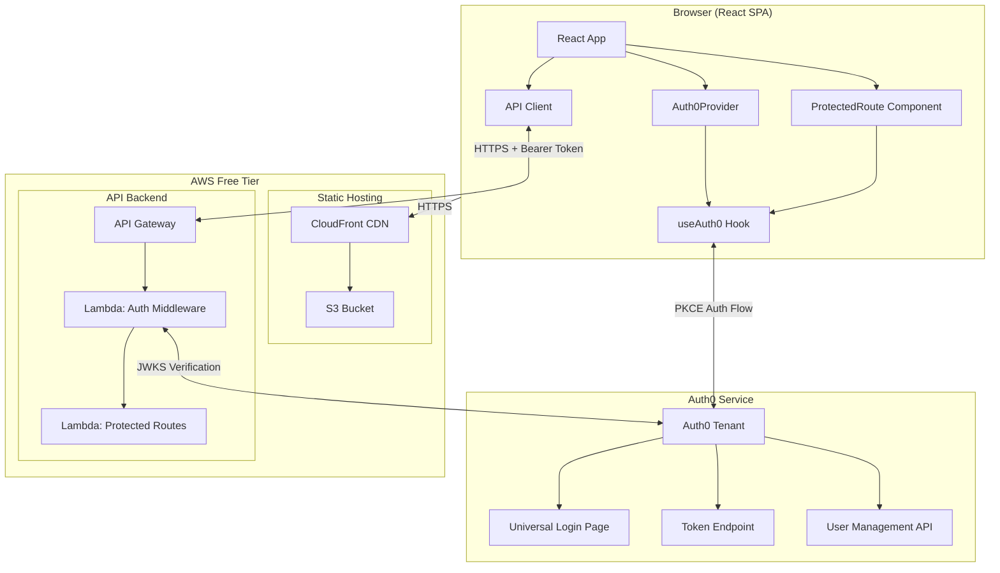
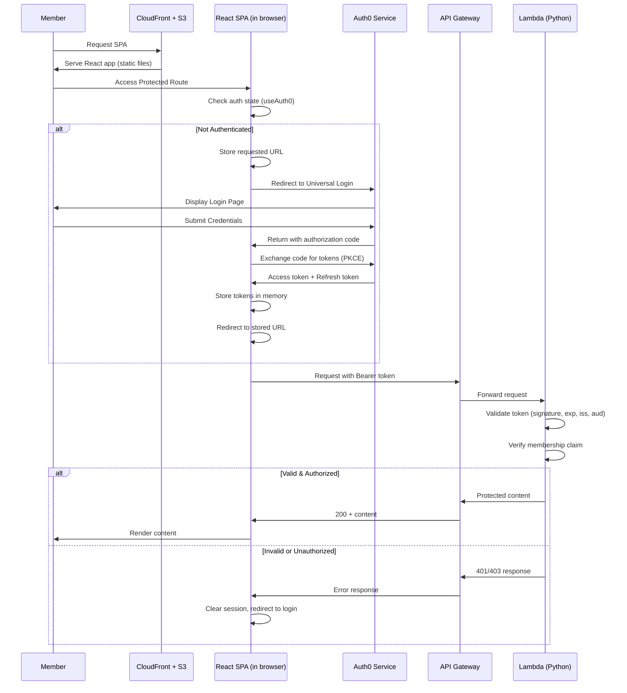
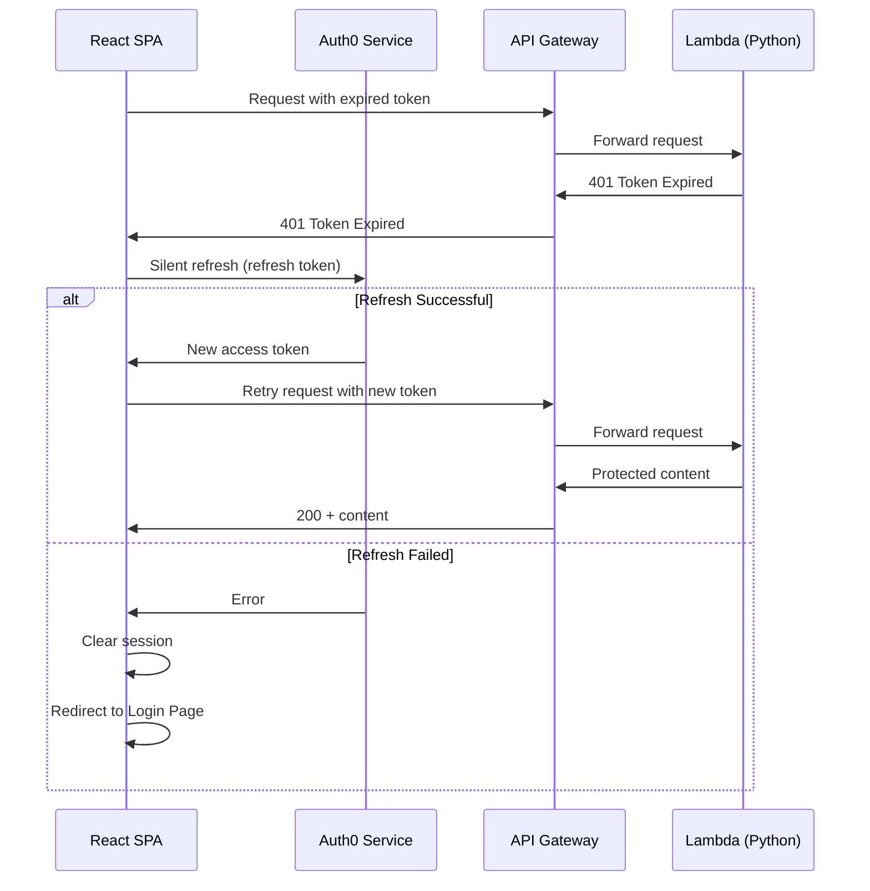
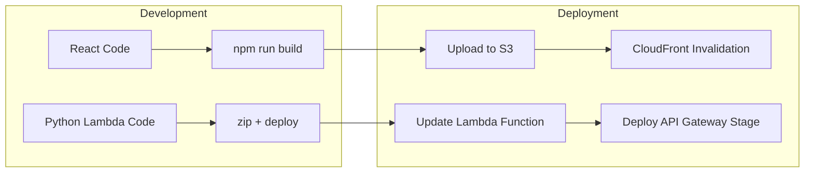

# Design Document

## Overview

The music-group-app is a private single-page application (SPA) serving a 20-member music group. It uses React as the frontend framework with Auth0 SPA SDK for authentication, and Python-based AWS Lambda functions behind API Gateway for the backend API. The React SPA is hosted as static files on S3 with CloudFront as the CDN. The entire stack runs within the AWS free tier for **$0 operational cost**.

**Key Design Decisions:**

- **React SPA + Auth0 SPA SDK**: Provides seamless redirect-based login flow with built-in token management, silent refresh, and secure in-memory token storage.
- **Python AWS Lambda backend**: Validates JWT tokens server-side, ensures content is never leaked to unauthenticated users, and enforces membership checks. Python chosen for its simplicity and excellent JWT/HTTP library ecosystem.
- **AWS API Gateway**: Exposes Lambda functions as REST endpoints with HTTPS enforcement, request throttling, and CORS support.
- **S3 + CloudFront for SPA hosting**: Static React build served globally via CloudFront CDN with HTTPS. No server to manage.
- **Auth0 free tier**: Supports up to 7,000 monthly active users (well within 20 members), provides refresh token rotation, and handles credential storage.
- **No localStorage/sessionStorage for tokens**: Tokens remain in memory (Auth0 SPA SDK default) or in secure HTTP-only cookies.

**Cost Analysis (AWS Free Tier):**

| Service | Free Tier Allowance | Expected Usage (20 members) |
|---------|--------------------|-----------------------------|
| Lambda | 1M requests/month, 400,000 GB-seconds | ~1,000 requests/month |
| API Gateway | 1M API calls/month (first 12 months) | ~1,000 calls/month |
| S3 | 5 GB storage, 20,000 GET requests | < 100 MB storage, ~5,000 GETs |
| CloudFront | 1 TB transfer/month (first 12 months) | < 1 GB/month |
| Auth0 | 7,000 MAU | 20 MAU |

## Architecture



### Authentication Flow



### Token Refresh Flow



### Deployment Architecture



## Components and Interfaces

### Frontend Components

| Component | Responsibility |
|-----------|---------------|
| `App` | Root component, wraps application in `Auth0Provider` |
| `Auth0Provider` | Configures Auth0 SDK with domain, clientId, audience, and redirect URI |
| `ProtectedRoute` | Route wrapper that redirects unauthenticated users to login |
| `LoginPage` | Public page with login button; displays auth errors |
| `UnauthorizedPage` | Shown to authenticated users who are not group members |
| `LogoutButton` | Triggers session termination and token revocation |
| `ApiClient` | Fetch wrapper that attaches Bearer token to API Gateway requests |
| `ErrorBoundary` | Catches auth errors, displays retry options for service unavailability |

### Backend Components (Python Lambda)

| Component | Responsibility |
|-----------|---------------|
| `handler.py` | Main Lambda entry point, routes requests based on API Gateway event |
| `auth.py` | JWT validation using `python-jose` with JWKS fetching and caching |
| `membership.py` | Verifies user is a registered member via token claims or Auth0 Management API |
| `routes.py` | Route handlers serving group content |
| `errors.py` | Centralized error handling, ensures no content leaks on auth failures |
| `session.py` | Validates inactivity timeout (30 min) and absolute timeout (72 hours) from token claims |
| `config.py` | Configuration from environment variables (Auth0 domain, audience, etc.) |

### Interfaces

```typescript
// Auth0 Configuration (Frontend)
interface Auth0Config {
  domain: string;          // Auth0 tenant domain
  clientId: string;        // SPA client ID
  audience: string;        // API identifier (API Gateway URL)
  redirectUri: string;     // Post-login redirect (CloudFront URL)
  scope: string;           // Requested scopes
}
```

```python
# Lambda Configuration (Backend)
@dataclass
class LambdaConfig:
    auth0_domain: str          # Auth0 tenant domain
    auth0_audience: str        # API identifier
    auth0_algorithms: list     # ['RS256']
    inactivity_timeout_s: int  # 1800 (30 minutes)
    absolute_timeout_s: int    # 259200 (72 hours)
    jwks_cache_ttl_s: int      # 3600 (1 hour JWKS cache)

# Token Validation Result
@dataclass
class TokenValidationResult:
    is_valid: bool
    claims: dict | None        # Decoded JWT claims if valid
    error: str | None          # Error description if invalid

# Membership Verification Result
@dataclass
class MembershipResult:
    is_member: bool
    user_id: str
    email: str

# API Gateway Lambda Event (simplified)
@dataclass
class APIGatewayEvent:
    http_method: str
    path: str
    headers: dict
    query_string_parameters: dict | None
    body: str | None

# Lambda Response
@dataclass
class LambdaResponse:
    status_code: int
    headers: dict
    body: str                  # JSON-encoded response body
```

### Auth Middleware Pipeline (Python Lambda)

```python
# Request processing order within the Lambda handler
def handle_request(event: APIGatewayEvent) -> LambdaResponse:
    # 1. Extract and validate JWT token
    token_result = validate_token(event.headers.get("Authorization"))
    if not token_result.is_valid:
        return unauthorized_response()

    # 2. Verify membership in Auth0 tenant
    membership = check_membership(token_result.claims["sub"])
    if not membership.is_member:
        return forbidden_response()

    # 3. Check session timeouts (from token issued-at claim)
    if is_session_expired(token_result.claims):
        return session_expired_response()

    # 4. Route to appropriate handler
    return route_request(event, token_result.claims)
```

## Data Models

### Auth0 Tenant Configuration

The Auth0 tenant is the single source of truth for membership. No separate user database is required.

```python
# Auth0 User (stored in Auth0 tenant)
@dataclass
class Auth0User:
    user_id: str             # Auth0 unique identifier
    email: str               # Member email
    name: str                # Display name
    picture: str | None      # Avatar URL
    email_verified: bool     # Email verification status
    created_at: str          # ISO 8601 timestamp
    last_login: str | None   # ISO 8601 timestamp

# JWT Access Token Claims (decoded from token)
@dataclass
class AccessTokenClaims:
    iss: str                 # Issuer: https://{domain}/
    sub: str                 # Subject: Auth0 user_id
    aud: str | list          # Audience: API identifier
    iat: int                 # Issued at (Unix timestamp)
    exp: int                 # Expiration (Unix timestamp)
    scope: str               # Granted scopes
    azp: str                 # Authorized party (client ID)
```

```typescript
// Client-side session tracking (in memory only, within React SPA)
interface ClientSession {
  accessToken: string;       // JWT access token (in memory)
  refreshToken: string;      // Refresh token (in memory via Auth0 SDK)
  user: Auth0User;           // Decoded user profile
  loginTimestamp: number;    // Absolute session start (Unix ms)
  lastActivityTimestamp: number; // Last interaction (Unix ms)
}
```

### API Gateway Route Structure

```python
# Route definitions for API Gateway + Lambda
# All routes require authentication unless marked public

PUBLIC_PATHS = {
    "/health",       # Health check endpoint
}

PROTECTED_PATHS = {
    "/api/content",  # Group content (GET)
    "/api/members",  # Member list (GET)
}

# API Gateway resource configuration
# Base URL: https://{api-id}.execute-api.{region}.amazonaws.com/{stage}/
```

### Infrastructure Configuration

```python
# S3 Bucket Configuration
S3_CONFIG = {
    "bucket_name": "music-group-app-spa",
    "website_index": "index.html",
    "website_error": "index.html",  # SPA fallback for client-side routing
    "public_access": False,          # Only accessible via CloudFront OAI
}

# CloudFront Configuration
CLOUDFRONT_CONFIG = {
    "origin": "S3 bucket (OAI restricted)",
    "default_root_object": "index.html",
    "custom_error_responses": [
        {"error_code": 403, "response_page": "/index.html", "response_code": 200},
        {"error_code": 404, "response_page": "/index.html", "response_code": 200},
    ],
    "viewer_protocol_policy": "redirect-to-https",
    "price_class": "PriceClass_100",  # Cheapest (US, Canada, Europe)
}

# Lambda Configuration
LAMBDA_CONFIG = {
    "runtime": "python3.12",
    "memory_mb": 128,              # Minimum (sufficient for JWT validation)
    "timeout_s": 10,               # Match Auth0 timeout requirement
    "environment": {
        "AUTH0_DOMAIN": "...",
        "AUTH0_AUDIENCE": "...",
        "AUTH0_ALGORITHMS": "RS256",
    },
}

# API Gateway Configuration
API_GATEWAY_CONFIG = {
    "type": "REST",
    "stage": "prod",
    "cors": {
        "allow_origins": ["https://{cloudfront-domain}"],
        "allow_methods": ["GET", "POST", "OPTIONS"],
        "allow_headers": ["Authorization", "Content-Type"],
    },
}
```

## Correctness Properties

*A property is a characteristic or behavior that should hold true across all valid executions of a system — essentially, a formal statement about what the system should do. Properties serve as the bridge between human-readable specifications and machine-verifiable correctness guarantees.*

### Property 1: Unauthenticated access redirects with no content and preserves URL

*For any* protected route path, when an unauthenticated user requests that path, the application SHALL return a response containing no group content in the body AND redirect to the login page with the originally requested URL preserved in state.

**Validates: Requirements 1.1, 4.2**

### Property 2: Post-authentication redirect targets correct destination

*For any* valid access token and any stored redirect URL (including null), the application SHALL create a session and redirect to the stored URL if present, or to the default landing page if no URL was stored.

**Validates: Requirements 1.3**

### Property 3: Valid session grants access to all protected routes

*For any* member with a valid session (not expired, not timed out) and any protected route, the application SHALL allow access without requiring re-authentication.

**Validates: Requirements 2.1**

### Property 4: Expired token triggers silent refresh

*For any* expired access token paired with a valid refresh token, the application SHALL transparently obtain a new access token and retry the request without requiring member interaction.

**Validates: Requirements 2.2**

### Property 5: Session timeout enforcement

*For any* session where either (a) the time since last activity exceeds 30 minutes, or (b) the time since session creation exceeds 72 hours, the application SHALL terminate the session and redirect to the login page on the next request, regardless of other session validity.

**Validates: Requirements 2.5, 2.6**

### Property 6: Non-member authenticated users are denied access

*For any* authenticated user whose identifier is not present in the Auth0 tenant membership list, and any protected route, the application SHALL deny access and display an unauthorized message with an option to return to the login page.

**Validates: Requirements 3.2**

### Property 7: Unauthenticated responses are identical regardless of resource existence

*For any* two URLs — one that maps to an existing resource and one that does not — when accessed by an unauthenticated user, the application SHALL produce identical responses (same status code, same redirect, no content difference that reveals resource existence).

**Validates: Requirements 4.4**

### Property 8: No tokens stored in browser-accessible storage

*For any* sequence of authentication operations (login, token refresh, navigation, logout), at no point SHALL localStorage or sessionStorage contain any access token or refresh token.

**Validates: Requirements 5.1**

### Property 9: Token validation rejects invalid tokens with no content

*For any* token that fails validation on signature, expiration, issuer, or audience claims, the application SHALL reject the request with an empty response body, clear the local session state, and redirect to the login page.

**Validates: Requirements 5.3, 5.4**

## Error Handling

### Authentication Errors

| Error Condition | Response |
|----------------|----------|
| Auth0 returns authentication error | Display error message on Login_Page, allow retry |
| Auth0 unreachable / timeout (>10s) | Display "service temporarily unavailable" message with retry option |
| Token refresh failure | Terminate session, redirect to Login_Page |
| Invalid token on request | Lambda returns 401 with empty body, SPA clears session and redirects to Login_Page |

### Authorization Errors

| Error Condition | Response |
|----------------|----------|
| Authenticated but not a member | Lambda returns 403, SPA displays "not authorized" page with option to return to Login_Page |
| Member removed from tenant | Lambda denies next request, SPA terminates active session |
| Tenant at 20-member capacity | Auth0 Management API rejects addition (handled outside app) |

### Network and Service Errors

| Error Condition | Response |
|----------------|----------|
| API Gateway / Lambda request fails (network) | SPA displays user-friendly error, offers retry |
| JWKS endpoint unreachable from Lambda | Lambda rejects token validation (fail closed), returns 401 |
| Lambda cold start timeout | API Gateway configured with 10s timeout; retry on client side |
| Unexpected Lambda error | Return generic 500 error, log details to CloudWatch, never expose internals |

### Error Handling Principles

1. **Fail closed**: Any authentication/authorization uncertainty results in denial of access
2. **No content leakage**: Error responses for protected routes never contain group content
3. **Consistent responses**: Unauthenticated errors are identical regardless of resource existence
4. **Graceful degradation**: Service unavailability shows helpful messages with retry options
5. **No infinite loops**: Redirect loops are prevented by the login page being a public route

## Testing Strategy

### Unit Tests (Example-Based)

Unit tests cover specific scenarios and integration points:

- **Auth error display** (Req 1.4): Verify specific error types render correctly on Login_Page
- **Auth0 timeout handling** (Req 1.6): Mock 10-second timeout, verify error message and retry option
- **Token refresh failure** (Req 2.3): Mock failed refresh, verify session termination and redirect
- **Logout flow** (Req 2.4): Trigger logout, verify token revocation and redirect
- **Membership check per request** (Req 3.3): Verify Lambda handler invokes membership check on each request
- **Public route content check** (Req 4.3): Verify public responses contain no group data
- **HTTPS enforcement** (Req 5.2): Verify all API client URLs use HTTPS scheme

### Property-Based Tests

Property tests validate universal correctness properties across generated inputs. Each property test runs a minimum of 100 iterations.

| Property | Test Description | Generator Strategy |
|----------|-----------------|-------------------|
| Property 1 | Unauthenticated redirect | Generate random URL paths (valid, nested, with query params) |
| Property 2 | Post-auth redirect | Generate random stored URLs (including null, empty, relative, absolute) |
| Property 3 | Valid session access | Generate random routes × valid session states |
| Property 4 | Silent token refresh | Generate expired tokens with valid refresh tokens |
| Property 5 | Session timeouts | Generate random timestamps around 30-min and 72-hr boundaries |
| Property 6 | Non-member denial | Generate random user IDs not in a generated member list |
| Property 7 | Identical unauthenticated responses | Generate pairs of existing/non-existing URLs |
| Property 8 | No tokens in storage | Generate sequences of auth operations, check storage after each |
| Property 9 | Invalid token rejection | Generate tokens with invalid signatures, expired, wrong issuer, wrong audience |

**PBT Libraries:**

- **Frontend (React)**: [fast-check](https://github.com/dubzzz/fast-check) (TypeScript/JavaScript property-based testing)
- **Backend (Python Lambda)**: [Hypothesis](https://hypothesis.readthedocs.io/) (Python property-based testing)

**Tag format**: Each test is tagged with:
```
Feature: music-group-app, Property {N}: {property_text}
```

**Configuration:**
- fast-check: `numRuns: 100` (minimum)
- Hypothesis: `@settings(max_examples=100)` (minimum)

### Integration Tests

Integration tests verify Auth0 service interaction with 1-3 representative examples:

- Full login flow with Auth0 Universal Login (Req 1.2)
- Member addition/removal reflected in access control (Req 3.4, 3.5)
- 20-member limit enforcement in Auth0 tenant (Req 3.1, 3.6)
- Token exchange and PKCE flow with Auth0 (Req 1.2)
- Lambda cold start + API Gateway round trip

### Test Environment

- **Frontend unit/property tests**: Vitest + fast-check, mocked Auth0 responses
- **Backend unit/property tests**: pytest + Hypothesis, mocked Auth0 JWKS/Management API
- **Integration tests**: Auth0 test tenant with test users, deployed Lambda in test stage
- **E2E tests**: Playwright for full browser flows (optional, lower priority)
